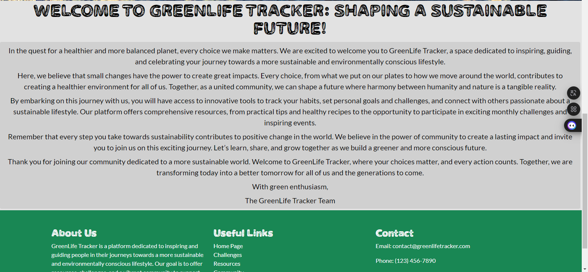
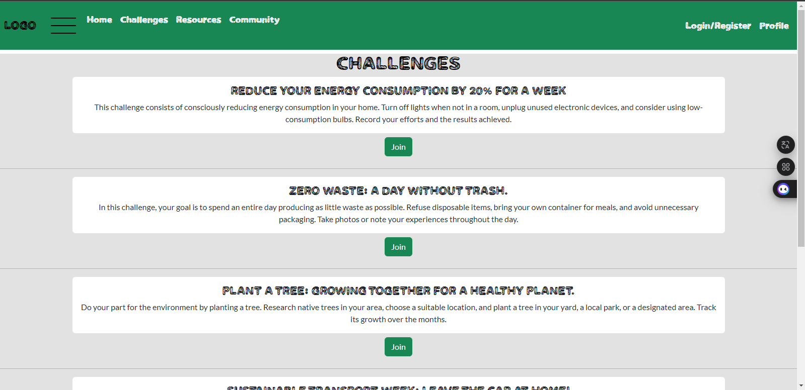
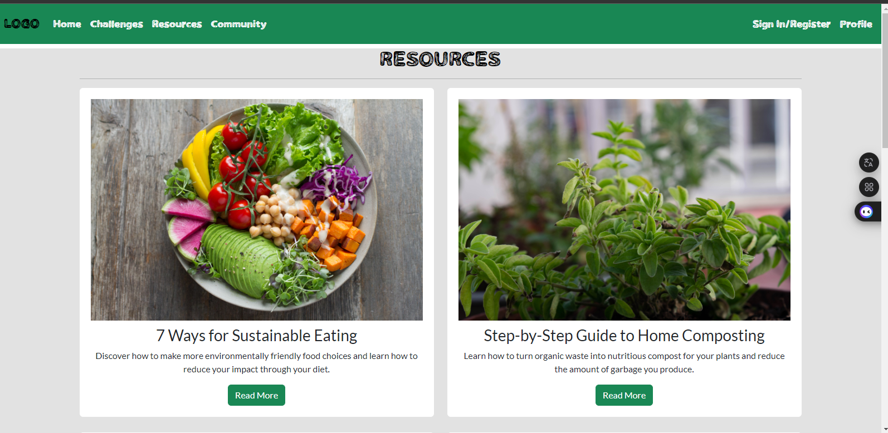
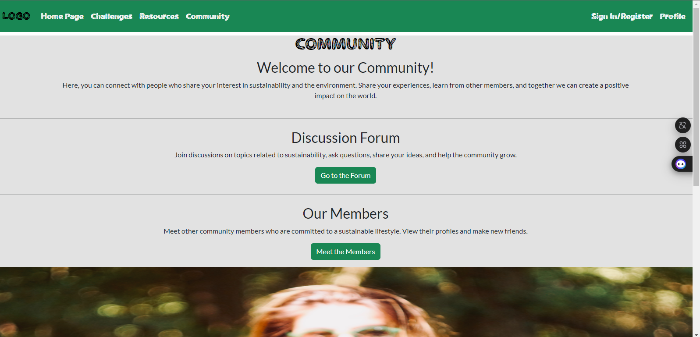
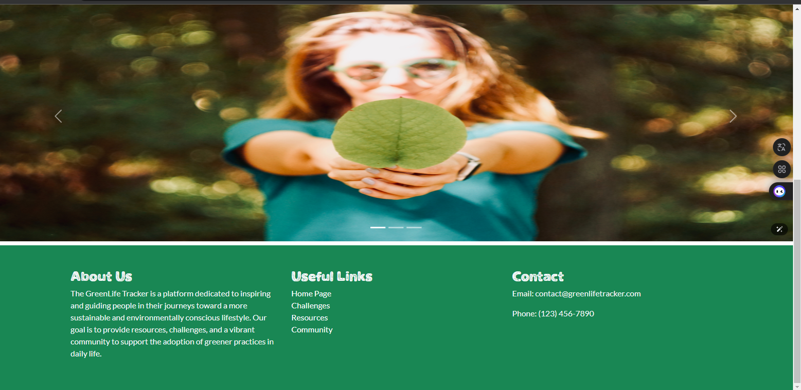
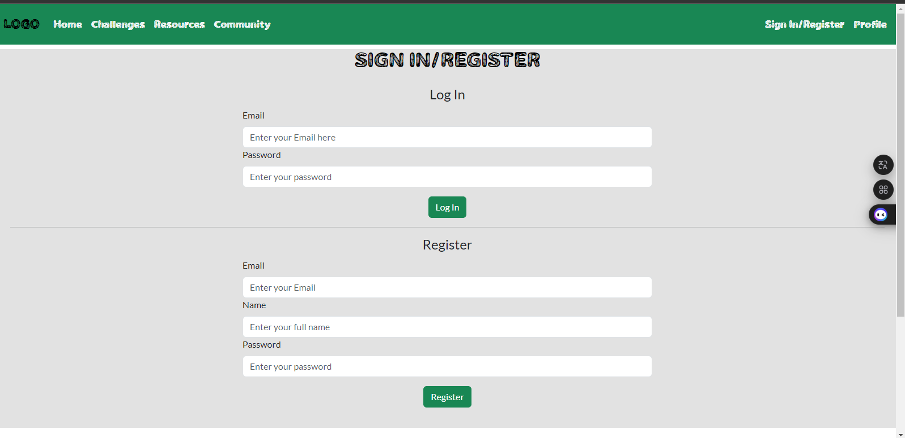
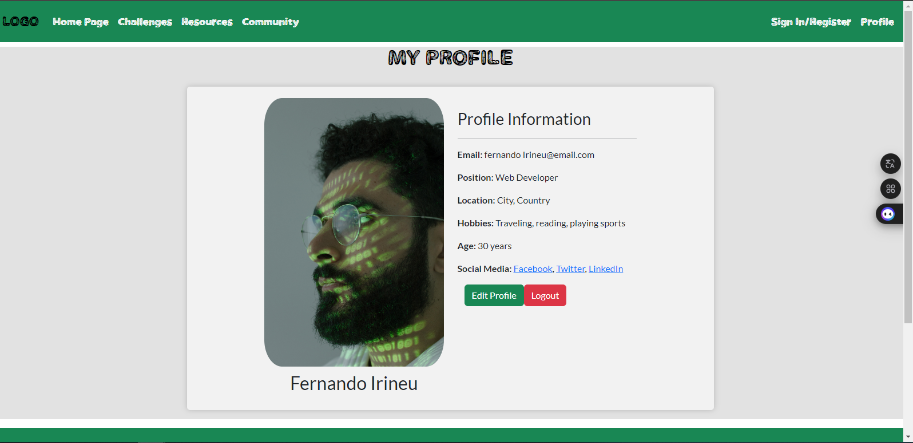

# Green Life Tracker

### Como Rodar esse projeto
#### How to run this project

#### 

### Descrição

Green Life tracker é um projeto FrontEnd, desenvolvido na avaliação final do curso de FrontEnd no senai Brasília, ele é apenas FrontEnd e não possui funcionalidades backend 

Ele possui 7 páginas: desafios, comunidade, forum, membros, perfil, recursos e Login

As Tecnologias usadas foram: Bootstrap, html, css e Javascript

#### Description

Green Life tracker is a project FrontEnd developed at the final avaliation in Senai Brasília, he is just frontEnd and no have funcionality.

He has 7 pages, challengers, comunity, forum, member, profile, resources and SignIn

Was used the technologies: Bootstrap, html, css and Javascript

### Passos/Steps
1 - Clone o Repositório/ Clone The Repository

    git clone https://github.com/fabricio176/blogGreenLifeTracker-bootstrap.git 

2 - Abra o Index.html/ Open the index.html

    bloggreenlifetracker-bootstrap/index.html

### Página Inicial/Home Page

### Desafios/Challenge

### Recursos/Resources

### Comunidade/Community

### Fórum/Forum

### Cadastrar-se/SignIn

### Perfil/Profile
